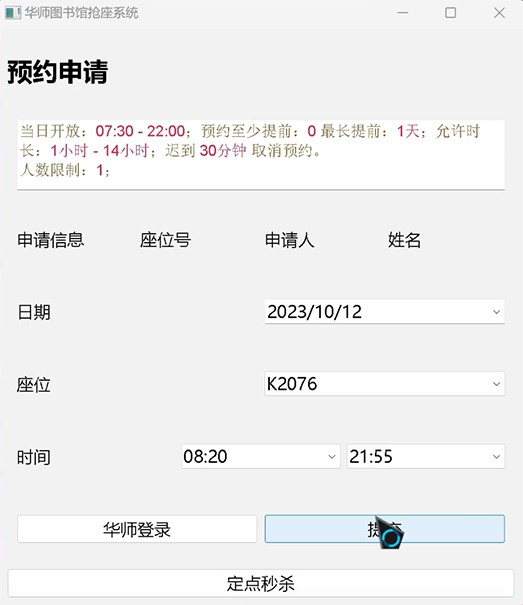
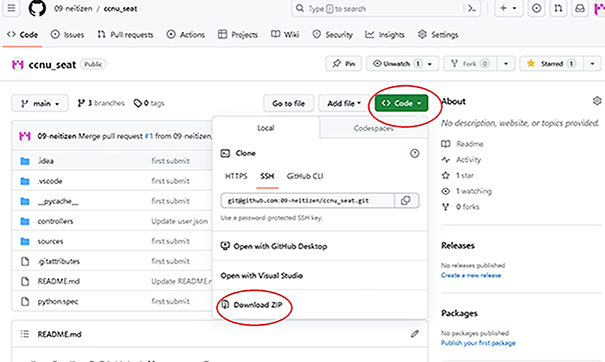

# PyQt5_CCNU_Library_Seat

#### 这是一个仅供学习和交流使用的ccnu图书馆一键预约座位软件

采用PyQt5开发，需要学生提供学号和密码，仅需填写一次即可
软件功能有普通提交和定点秒杀

#### 普通提交

1、选择日期，时间以及座位号

2、点击华师登录按钮，会弹出华师登录网页，第一次需要在最上方的用户名和密码输入框中输入学号密码，然后一定要点击保存，这样之后就不用再输入学号密码了。

3、点击提交

#### 定点秒杀

定点秒杀功能为当到达你设定的时间后，就会自动选座

在选择好日期，时间和座位号后，点击定点秒杀，在弹出的窗口中，输入你想定的时间，默认为每天的晚上6点，然后点击start timer即可

#### 软件使用

若要使用软件，还请移步到https://github.com/09-neitizen/ccnu_seat

然后下载zip压缩包，解压后

双击ccnu_seat/tree/main/controllers/dist下的maincontroller.exe即可使用该软件

#### 软件首页

